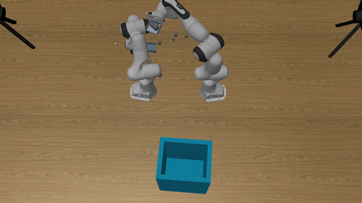

# Final Project
The final project is to test your knowledge about robotics control. You are also encouraged to introduce machine learning techniques to enhance the performance and stablitiy.

## Getting started
Please follow the document of [SAPIEN](https://sapien.ucsd.edu/) to install the environment. Currently, only Ubuntu is fully supported. MacOS is experimentally supported and feel free to report any bug.
```bash
# Use the correct pip if you are using virtualenv or conda.
pip install sapien==0.6.0.dev0
pip install transforms3d
```
It is recommended to use an editor like VSCode or Pycharm, so that you can jump to the definition to check Sapien's APIs.

## Instruction
In this assignment, you need to control two robot arms to pick up boxes and place them at the target bin efficiently. Note that the end-effectors are spades rather than fingers.



The starter code provides these files:
- [solution.py](solution.py): implement this file.
- [main.py](main.py): run this file to debug and evaluate your code.
- [final_env.py](final_env.py): provide the environment for your final project; if you modify this file, make sure you restore it to the original state when testing.

In the following sections, we will describe the environment, the robots, and the objective.

#### Environment
The scene contains two robot arms, multiple boxes, and a bin. Four cameras (front, left, right, top) are mounted to provide different viewpoints of the scene. The scene is randomly generated by the environment. Different scenes have different configurations, including the size of the spades, the sizes and positions of the boxes, and the size and position of the bin. 

As illustrated in the main.py, `env.run(solution)` is called to start the environment with a solution. Similar to [OpenAI Gym](https://gym.openai.com/), the environment calls `env.reset()` before each episode to randomly generate a new scene, and the episode ends if it reaches the local maximum time step `env.local_max_steps` or the solution returns False (will be discussed later). Note that the environment will start a new episode after the current episode ends, until it reaches the global maximum time step `env.global_max_steps`. To generate the same scenes, you can specify the random seed by calling `np.random.seed(...)` before `env.run(...)`.

You can access the cameras, which are instances of the class `Camera` defined in the final_env.py, by calling `env.get_agents()`. You can call `camera.get_observation()` to acquire RGB, depth and segmentation (each object is labeled with a unique id) images. You can also call `camera.get_metadata()` to acquire camera information, like intrinsic and extrinsic matrices. You do not need to calibrate the camera.

**It is recommended to go through the final_env.py before you start. Please read the docstrings as well.**

#### Robots
You need to control two robots in this assignment. The individual robot is similar to the robot in previous assignments, except that the end-effectors are spades rather than fingers. It is more difficult to control two robots since you need to take the collision of two robot arms and how they collaborate to pick up objects into consideration.

You can access the robots, which are instances of the class `Robot` defined in the final_env.py, by calling `env.get_agents()`. You can call `robot.get_observation()` to acquire joint poses and velocities as well as link poses. You can also call `robot.configure_controllers(...)` to configure the internal PD controller and call `robot.set_action(...)` to set the target joint poses and velocities as well as compensation forces.

> It is recommended to start with the internal controller. If you would like to implement your own controller, you can set 0 for all the parameters of the internal PD controller, and pass the forces `qf` computed by your own controller to `robot.set_action(..., additional_force=qf)`.

#### Objective
The objective is to place as many boxes as possible at the target bin. The environment will keep running for fixed time steps. During this period, your algorithm should **either control the robots at each (actionable) time step**, or **return `False` to forfeit the current scene** if it believes that it gets stuck. The environment will not finish itself even all boxes are correctly placed, so you should also return `False` if you think the task has been completely solved. When a `False` is returned, the environment will be reset and a new scene will be generated.

To evaluate the performance of your algorithm, we introduce two metrics: *success rate* and *efficiency*. *Success rate* is the fraction of the number of boxes correctly placed among the number of boxes observed in all the scenes. *Efficiency* is the average number of boxes correctly placed per minute. Given a fixed time budget, *efficiency* is equivalent to the total number of boxes correctly placed. To increase *success rate*, you need to implement some good strategies to pick up and place boxes. To increase *efficiency*, you need to decide when the algorithm should move on to a new scene.

You need to implement `solution.init` and `solution.act` for the `Solution` class. `solution.init()` is called to initialize your solution after the environment is reset. `solution.act(...)` is called at each (actionable) time step to set robot actions. Note that if it returns `False`, then the environment will continue to the next scene.

## Hints

### How to find the absolute position for a pixel in an image?
We provide the `env.get_global_position_from_camera` to show how to read the world position of a pixel of a camera.

### How to find the boxes and robot links in the images?
The `link_ids` in robot metadata are the ids for each robot link. This can be used to understand the segmentation output of the cameras. The segmentation (3rd output of camera observation) is a numpy array of 2D integers representing the actors and links the camera sees. The robot link ids will be rendered on this image. Similarly, in the metadata of the env, there are `box_ids` and `bin_id`. You can look for these ids in the segmentation
images and find their world positions.

### How to use the compute functions provided by the robot
1. `forward_dynamics`: compute the forward dynamics **WITHOUT** considering gravity balance and Coriolis balance. User will need to call `passive_force` to compute the required gravity and Coriolis force.
2. `inverse_dynamics`: compute the inverse dynamics **WITHOUT** considering gravity and Coriolis forces. User will need to use `passive_force` to add these additional forces.
3. `adjoint_matrix`: get the corresponding adjoint matrix of the transformation from one link to the other.
4. `spatial_twist_jacobian`: the full Jacobian matrix we learned in class, it transforms qvel to link twist.
5. `world_cartesian_jacobian`: the Jacobian matrix that transforms qvel to cartesian velocity and angular velocity.
6. `manipulator_inertia_matrix`: the inertia matrix (DOF x DOF in size) 
7. `transformation_matrix`: compute the transformation from one link to the other.
8. `passive_force`: compute the gravity, Coriolis, and external forces needed to keep the robot at current configuration. Adding this computed force will essentially make the robot keep its current joint motion.
9. `twist_diff_ik`: given a spatial twist, a link index, and a set of joint indices (the index of a joint is its index in the list returned by `get_joints`), this function computes the joint velocities required to make the given link move with the given twist.
10. `cartesian_diff_ik`: similar to `twist_diff_ik` except that the twist now becomes velocity and angular velocity.

### How the demo above is generated
The algorithm used to generate the demo video has the following steps:
1. We manually find a joint position to initialize the 2 robot hands (just make
   sure they do not collide) and drive the robot there.
2. We use the metadata of the scene to find the ids of the boxes, and then get
   the positions of all boxes from the top camera. We randomly choose a box.
3. We use the same control methods as in homework 2 to drive the robot hands
   towards the table, and then drive them towards the block while touching the
   table.
4. We just assume some blocks will be on the right hand. Now we move the left
   hand away while lifting the right hand.
5. We drive some robot joints towards a desired goal while using other joints
   (and Jacobian) to keep the hand in a horizontal pose.
6. We dump the blocks by tilting the hand at a hard-coded position.
7. Go to step 1.

All these steps are far from optimal, and you should be able to create far
better control methods than this one. We provide [baseline.py](baseline.py) as reference. Note that we use `cartesian_diff_ik` in the baseline, but `twist_diff_ik` is actually what we learn.

## Grading
The assignment will be evaluated by the performance of your program (20 points) and the report (10 points).

### Performance
The performance is evaluated by two metrics: *success rate* and *efficiency*.
The (experimental) rubric to evaluate the performance is listed as follows:

| success rate | score | efficiency (per minute) | score |
|--------------|-------|-------------------------|-------|
| <25%         | 0     | <0.5                    | 0     |
| 25%-50%      | 0-10  | 0.5-1.5                 | 0-10  |
| >50%         | 10    | >1.5                    | 10    |

## Academic integrity
You are allowed to work in teams, but are not allowed to use the answers developed by others. You are not allowed to copy online resources, like GitHub repositories. Please ask the instructor first if you are not sure whether you can refer to some resources.

If the work you submit is determined to be other than your own, you will be reported to the Academic Integrity Office for violating UCSD's Policy on Integrity of Scholarship.
